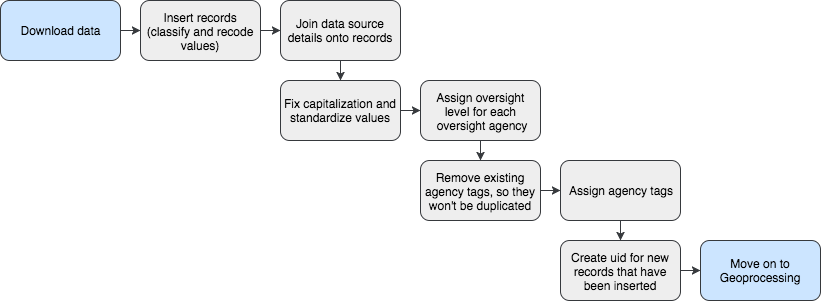

## Database and Documentation:

  * [NYC Facilities Explorer](http://capitalplanning.nyc.gov/facilities)
  * [Data Download](https://www1.nyc.gov/site/planning/data-maps/open-data/dwn-selfac.page)
  * [Data User Guide / Documentation](http://docs.capitalplanning.nyc/facdb/)

## Summary of Build Process and Stages:

### 1 . Obtaining Data

The build follows an Extract -> Load -> Transform sequence rather than an ETL (Extract-Transform-Load) sequence. All the source datasets are first loaded into PostGreSQL using the [Civic Data Loader](https://github.com/NYCPlanning/civic-data-loader) scripts. After the required source data is loaded in the PostGIS database, the build or update process begins, consisting of four phases: Assembly, Geoprocessing, Deduping, and Exporting.

[`1_download.sh`](https://github.com/NYCPlanning/facilities-db/blob/master/run_download.sh) script downloads and loads all the neccesary source datasets for the Facilities Database (FacDB).

### 2. Assembly

Creates the empty FacDB table, matches and inserts desired columns from the source data into the FacDB schema, recodes variables, classifies the facilities, and concatenates the DCP ID. The end product is all the records and available attributes from the source datasets formatted, recoded (if necessary), and inserted into the FacDB table. There are many missing geometries and other missing attributes related to location like addresses, zipcodes, BBLs, and BINs. A diagram of the [assembly process](https://github.com/NYCPlanning/facilities-db#assembly) is provided below.

[`2_assembly.sh`](https://github.com/NYCPlanning/facilities-db/blob/master/run_download.sh) script runs all the steps in the Assembly process and is annotated to decribe each of the scripts used.

### 3. Geoprocessing

Fills in all the missing values that weren't provided in the source data before doing a final round of formatting and cleanup. Records without geometries get geocoded, x & y coordinates (SRID 2263) are calculated and filled in, and spatial joins with MapPLUTO are performed to get additional location details like BBL and addresses when missing. Finally, a script performs final formatting by querying for acronyms that need to be changed back to all caps. A diagram of the [geoprocessing steps](https://github.com/NYCPlanning/facilities-db#geoprocessing) is provided below.

[`3_geoprocessing.sh`](https://github.com/NYCPlanning/facilities-db/blob/master/run_geoprocessing.sh) script runs all Geoprocessing steps and is annotated to decribe each of the scripts used.

### 4. Deduping

Fills in all the missing values that weren't provided in the source data before doing a final round of formatting and cleanup. Records without geometries get geocoded, x & y coordinates (SRID 2263) are calculated and filled in, and spatial joins with MapPLUTO are performed to get additional location details like BBL and addresses when missing. Finally, a script performs final formatting by querying for acronyms that need to be changed back to all caps. A diagram of the [deduping process](https://github.com/NYCPlanning/facilities-db#deduping) is provided below.

[`4_deduping.sh`](https://github.com/NYCPlanning/facilities-db/blob/master/run_deduping.sh)  script runs all the steps in the Deduping process and is annotated to decribe each of the scripts used.

### 5. Exporting

[`5_export.sh`](https://github.com/NYCPlanning/facilities-db/blob/master/run_export.sh) script runs each of the scripts that export each of the data views that get published and are used for the NYC Facilities Explorer and other documentation.

## Prerequisites:

1. Create an environment variable in your bash profile that provides your DATABASE_URL. This gets used in both the run_assembly.sh and run_processing.sh scripts.
  * `cd ~/.bash_profile`
  * Open .bash_profile in Sublime and add the following code:
  * `export DATABASE_URL=postgres://{User}:{Password}@{Host}:{Post}/{Database}`
  * Check that it was created successfully with `printenv`

## Scheduled Maintenance and Data Quality Checks:

Coming soon!

## Process Diagrams

### Assembly

### Geoprocessing

### Deduping

